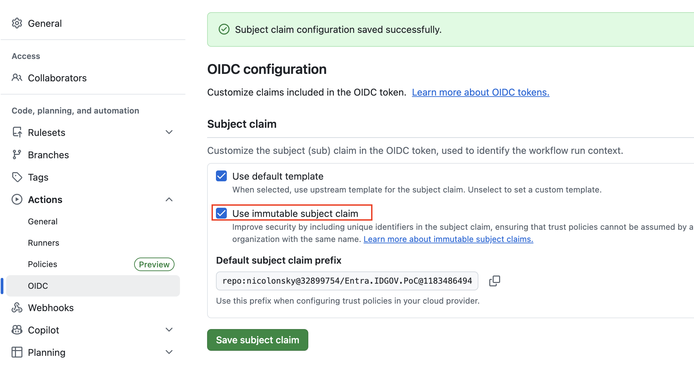
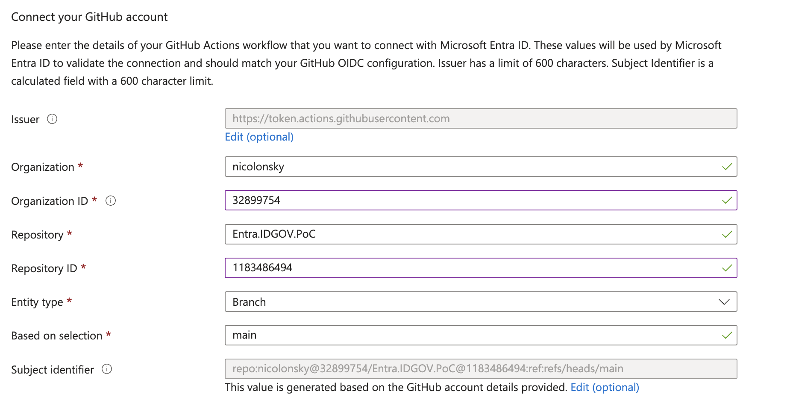

# Entra ID Governance PoC in a Box

A compact proof of concept that converts HR data from CSV into a SCIM bulk request and submits it to Microsoft Entra API-driven inbound provisioning from GitHub Actions.

## How it works

1. `HRData.csv` supplies authoritative worker records.
2. `ConvertTo-SCIMUser.ps1` maps those records to `SCIMBulkRequest.json`.
3. `Invoke-POSTSCIMUser.ps1` posts the payload to the provisioning job's `/bulkUpload` endpoint.
4. `.github/workflows/sync.yaml` runs the process on every push and once per hour.
5. Microsoft Entra applies the provisioning app's scope and attribute mappings to create or update users.

## Prerequisites

- A Microsoft Entra tenant with the required API-driven provisioning license.
- An account with at least the **Application Administrator** role.
- A GitHub repository containing this project.
- PowerShell 7 for local testing.
- A verified domain in Microsoft Entra ID for generated user principal names.

This guide configures **API-driven provisioning to Microsoft Entra ID** for cloud-only users. The on-premises Active Directory template additionally requires the Hybrid Identity Administrator role and a Microsoft Entra provisioning agent.

## 1. Create the API-driven inbound provisioning app

1. Open the [Microsoft Entra admin center](https://entra.microsoft.com).
2. Go to **Entra ID** > **Enterprise apps** > **New application**.
3. Search for `API-driven` and select **API-driven provisioning to Microsoft Entra ID**.
4. Give the application a descriptive name and select **Create**.
5. Open **Provisioning** > **Get started**.
6. Change **Provisioning Mode** from **Manual** to **Automatic**, then select **Save**.
7. Under **Settings**, enter a valid **Notification Email** and save again. This is required; omitting it can place the job in quarantine.
8. Select **Start provisioning** to place the job in listen mode.
9. On **Provisioning** > **Overview**, expand **Statistics to date** > **View technical information** and copy the **Provisioning API Endpoint**.

The endpoint has this form:

```text
https://graph.microsoft.com/v1.0/servicePrincipals/<PROVISIONING_APP_OBJECT_ID>/synchronization/jobs/<JOB_ID>/bulkUpload
```

Use the enterprise application's **Object ID**, not its application/client ID.

## 2. Configure attribute mappings

Open the enterprise application, then go to **Provisioning** > **Edit provisioning** > **Mappings** and select the user mapping. Keep the default mappings initially, then verify or add the following mappings for this repository.

| SCIM source attribute | Microsoft Entra target | Mapping guidance |
| --- | --- | --- |
| `externalId` | `employeeId` | Direct; set **Match objects using this attribute** to **Yes** and matching precedence to `1`. `WorkerID` must be unique and stable. |
| `...` | `displayName` | Use an **expression** that creates a friendly display name. |
| `...` | `mailNickname` | Use an **expression** that creates a mailnickname. |
| `userName` | `userPrincipalName` | Use an **expression** that creates a valid UPN in a verified tenant domain. |
| `urn:ietf:params:scim:schemas:extension:enterprise:2.0:User:manager.value` | `manager` | Reference mapping; values must identify another worker included in the source data. |
| `active` | `accountEnabled` | Constant. Confirm the source script emits the intended status before enabling this mapping. |

Review the remaining default mappings, especially account status and UPN generation, before provisioning production users. The provisioning service uses the matching attribute to decide whether to create or update an account; the client always sends `POST` operations.

### Custom SCIM attributes

The payload also sends these custom attributes under `urn:ietf:params:scim:schemas:extension:csv:1.0:User`:

- `securityClearance`

To use one of them:

1. On the **Attribute Mapping** page, expand **Advanced Options** and select **Edit target User attributes**.
2. Add the full flattened SCIM path, for example:

	```text
	urn:ietf:params:scim:schemas:extension:csv:1.0:User:securityClearance
	```

3. Save the attribute list.
4. Select **Add New Mapping** and map the new source attribute to a compatible Microsoft Entra attribute. For example, map `...:securityClearance` to `employeeHireDate`.
5. Repeat for only the custom fields you need, then save the mappings.

Custom source attributes must exist in the provisioning schema before they appear in the mapping selector. Use a correctly typed target attribute and ensure date values use the format expected by that target.

## 3. Register the GitHub Actions application

Create a separate app registration that represents the GitHub workflow:

1. Go to **Entra ID** > **App registrations** > **New registration**.
2. Enter a name, keep the default single-tenant option, and select **Register**.
3. Record the **Application (client) ID** and **Directory (tenant) ID**.
4. Open **API permissions** > **Add a permission** > **Microsoft Graph** > **Application permissions**.
5. Add `SynchronizationData-User.Upload`.
7. Select **Grant admin consent** and verify that the status is granted.

Do not add delegated permissions. GitHub Actions runs without a signed-in user and therefore needs application permissions.

### Add the federated credential

This repository uses GitHub OpenID Connect (OIDC), so no client secret is required.

1. In the GitHub repository settings, visit OIDC
	- Check: [x] Use immutable subject claim
    - Copy the subject claim values
    - 
2. In the app registration, open **Certificates & secrets** > **Federated credentials** > **Add credential**.
3. Select **GitHub actions deploying Azure resources**.
4. Enter the exact GitHub **Organization** and **Repository** names and immutable IDs.
    - 
5. Select the entity type that matches how the workflow runs:
	- Choose **Branch** and enter the default branch when pushes to that branch should authenticate.
6. Enter a credential name and select **Add**.

The generated subject must exactly match the token requested by GitHub. Wildcards are not supported for branch or tag subjects. Because the supplied workflow currently runs on every push and does not declare an environment, either restrict its trigger to the configured branch or add a federated credential for each branch that is allowed to run it.

## 4. Configure this repository

All environment-specific runtime settings are centralized in the workflow-level `env` block in `.github/workflows/sync.yaml`. Update these values before running the workflow:

| GitHub Actions variable | Description |
| --- | --- |
| `ENTRA_TENANT_ID` | Microsoft Entra **Directory (tenant) ID**. |
| `ENTRA_CLIENT_ID` | **Application (client) ID** of the GitHub Actions app registration. |
| `PROVISIONING_ENDPOINT` | Complete **Provisioning API Endpoint** copied from the API-driven enterprise application. |
| `HR_DATA_PATH` | Repository-relative path to the source HR CSV file. |
| `SCIM_BULK_REQUEST_PATH` | Repository-relative path where the generated SCIM bulk request is written and then uploaded. |

For this PoC, these values are declared inline to make the workflow easy to understand. They can instead be stored as GitHub Actions repository or environment variables and referenced with the `vars` context, or as Actions secrets and referenced with the `secrets` context.

The workflow passes the configured paths to `ConvertTo-SCIMUser.ps1` and passes `PROVISIONING_ENDPOINT` plus `SCIM_BULK_REQUEST_PATH` explicitly to `Invoke-POSTSCIMUser.ps1`. No tenant-specific runtime value needs to be changed inside either script.

CSV column-to-SCIM attribute mappings remain schema logic in `ConvertTo-SCIMUser.ps1`. Update its mapping tables only when the input CSV schema or desired SCIM payload changes.

`Invoke-POSTSCIMUser.ps1` accepts these optional parameters:

| Parameter | Default | Description |
| --- | --- | --- |
| `ProvisioningEndpoint` | The sample repository's `/bulkUpload` endpoint | Complete Microsoft Graph provisioning endpoint to which the SCIM payload is submitted. |
| `SCIMBulkRequestPath` | `SCIMBulkRequest.json` in the script directory | Path to the generated SCIM bulk request JSON file. |

The script declares `#Requires -Modules Microsoft.Graph.Authentication`. Install the module before local execution; the supplied GitHub Actions workflow installs it automatically.

The current workflow uses [`nicolonsky/WIF`](https://github.com/nicolonsky/WIF) to exchange the GitHub OIDC token for a Microsoft Graph access token. Pin third-party actions to a full commit SHA for production use.

## 5. Prepare HR data

Keep the header names in `HRData.csv` aligned with the mapping tables in `ConvertTo-SCIMUser.ps1`. Important fields are:

- `WorkerID`: stable unique ID used for matching and manager references.
- `WorkerStatus`: expected to contain `TRUE` for active workers.
- `FirstName` and `LastName`: required identity data.
- `managerID`: the manager's `WorkerID`.
- `preferredLanguage`: a locale such as `en-GB`.

Do not commit real employee data to a public repository. Treat both the input CSV and generated SCIM artifact as sensitive identity data.

## 6. Run and verify

### GitHub Actions

Push a change to an allowed branch or wait for the hourly schedule. Open **Actions** > **SCIM Sync** to inspect the run. A successful upload returns HTTP `202 Accepted`; final user-level processing results appear later in the provisioning logs.

The workflow uploads `SCIMBulkRequest.json` as an artifact. Remove that step for production if retaining HR data in GitHub artifacts is not acceptable.

### Local test

Local execution uses delegated authentication and prompts for an administrator account:

```powershell
Install-Module Microsoft.Graph.Authentication -Scope CurrentUser

pwsh ./ConvertTo-SCIMUser.ps1

$provisioningEndpoint = 'https://graph.microsoft.com/v1.0/servicePrincipals/<PROVISIONING_APP_OBJECT_ID>/synchronization/jobs/<JOB_ID>/bulkUpload'
pwsh ./Invoke-POSTSCIMUser.ps1 -ProvisioningEndpoint $provisioningEndpoint
```

To upload a payload from another location, pass `-SCIMBulkRequestPath`:

```powershell
pwsh ./Invoke-POSTSCIMUser.ps1 `
	-ProvisioningEndpoint $provisioningEndpoint `
	-SCIMBulkRequestPath ./output/SCIMBulkRequest.json
```

Use `-WhatIf` to confirm the target endpoint without submitting the request.

The signed-in account must be allowed to consent to and use the `SynchronizationData-User.Upload` delegated scope. GitHub Actions uses the application permission configured in step 3 instead.

### Verify provisioning

1. Open the API-driven enterprise application in the Entra admin center.
2. Select **Provisioning** > **Provisioning logs**.
3. Confirm that each worker was matched, created, updated, skipped, or failed as expected.
4. Open a provisioned user and verify the UPN, employee ID, manager, status, and custom attributes.

## Troubleshooting

- **401 or 403 response:** Verify admin consent, `SynchronizationData-User.Upload` application permission, tenant/client IDs, and the OIDC federated subject.
- **404 response:** Copy the full endpoint again from the provisioning app. Do not combine IDs from different enterprise applications or jobs.
- **Payload accepted but no users appear:** Ensure the provisioning job is started, inspect the provisioning logs, and verify scope and attribute mappings.
- **Invalid UPN or domain:** Update the `userPrincipalName` mapping to generate a UPN in a verified domain. The sample `userName` is only a worker ID.
- **Duplicate users:** Confirm `externalId` maps to `employeeId` as the unique matching attribute and that every `WorkerID` is stable and unique.
- **Custom fields are ignored:** Add their full SCIM extension paths to the provisioning app schema, then create mappings to supported target attributes.
- **Job enters quarantine:** Set a notification email and review the provisioning logs for repeated failures.

## References

- [Configure an API-driven inbound provisioning app](https://learn.microsoft.com/entra/identity/app-provisioning/inbound-provisioning-api-configure-app)
- [Grant access to the inbound provisioning API](https://learn.microsoft.com/entra/identity/app-provisioning/inbound-provisioning-api-grant-access)
- [Extend API-driven provisioning with custom attributes](https://learn.microsoft.com/entra/identity/app-provisioning/inbound-provisioning-api-custom-attributes)
- [Configure workload identity federation for GitHub Actions](https://learn.microsoft.com/entra/workload-id/workload-identity-federation-create-trust#github-actions)
- [API-driven inbound provisioning concepts](https://learn.microsoft.com/entra/identity/app-provisioning/inbound-provisioning-api-concepts)
